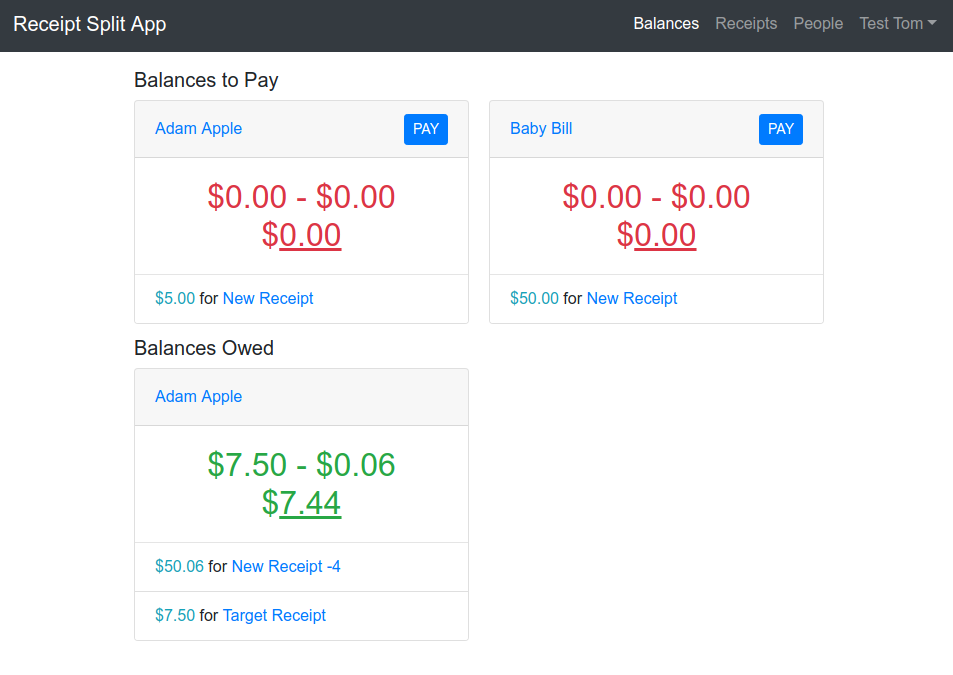
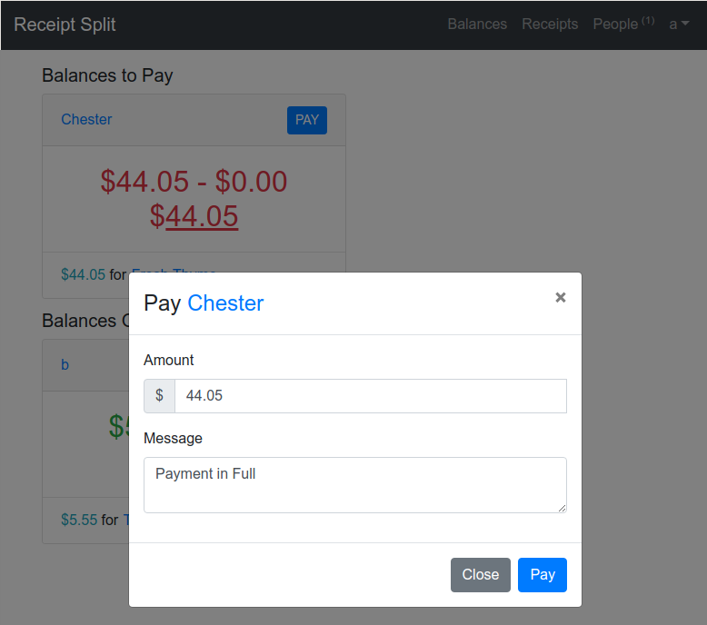
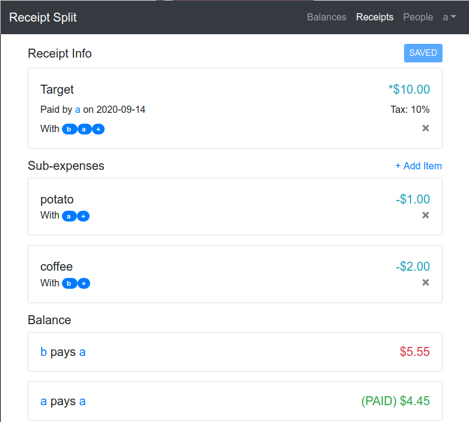
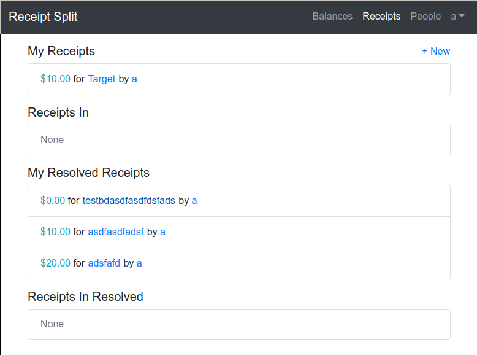
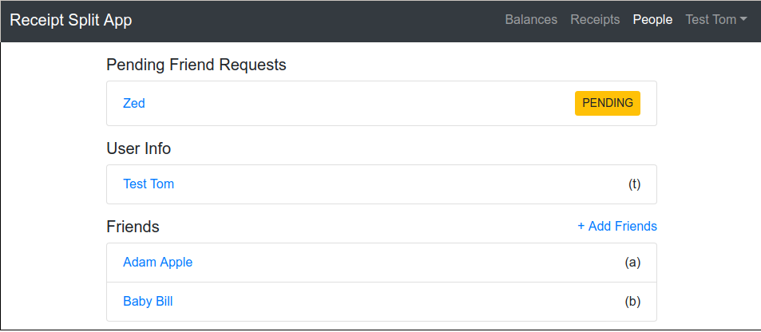
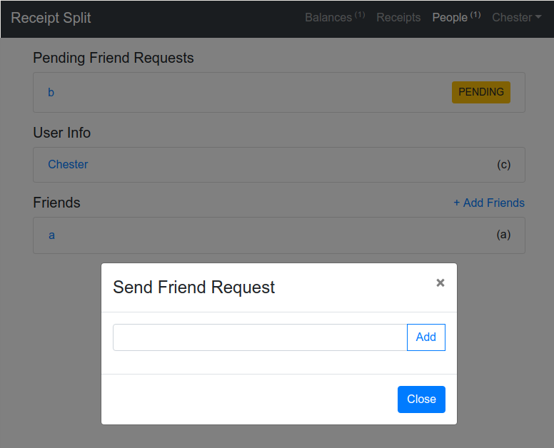

# Receipt-split [](https://travis-ci.org/isaaclo123/receipt-split)

https://receipt-split.isaaclo.site

https://hub.docker.com/repository/docker/isaaclo1234/receipt-split

Receipt-Split is an application that allows people to precisely share the costs of receipts.

One common issue when sharing the cost of receipts among roommates is that in receipts, usually many
items are shared, but some items may only be used by specific people. This app is designed to
address this problem, by providing an easy way to keep track of receipts while being able to split
the costs of items precisely.

## Balance Page

When first logging in to the app, you are directed to the Balance page. This page shows the amount
of money you are owed from and owe to other users; a balance.

The numbers on the balance card are in the format

```None
(total sum to pay) - (total sum of payments sent to user) = (remaining amount to pay)
```



To pay balances, you press the "Pay" button, where you enter a message and an amount of money to
pay. The user the payment is sent to can then choose to "accept" or "reject" the payment in the
"Payments Received" section of the page. The user sending a payment will have a "Payments Sent"
section in the page, showing the status of their payment: "pending", "accepted", or "rejected".



## Receipt Page

The receipt edit page allows you to create a receipt that you paid for and share the cost with
other users. In the "Receipt Info" section, you enter a name, date, total cost of the receipt, and
the tax rate for the receipt in percent. You can share the cost with friends in the "With" section,
by pressing the "+" button in the "With" section.

The "Sub-expenses" section represents items that are only shared by a subset of users in the
receipt. The users specified in the "With" section of each sub-expense are the only ones who will
have to pay for that sub-expense.

Upon saving the receipt, in the "Balance" section, Balances will be calculated for the receipt,
representing what each user must pay the owner of the receipt. When payments are accapted in the
Balances page, the amount in the accepted payment is applied to the balances in the receipt, marking
them as "PAID". When all balances in the receipt are paid, then the receipt is marked "Resolved"



The receipt list page has 4 sections. "My Receipts" lists the unresolved receipts you own. "Receipts
In" lists the unresolved receipts that you do not own but are in. "My Resolved Receipts" lists your
resolved receipts. "Receipts In Resolved" lists the resolved receipts you do not own, but are in.



## Friend Page

This page shows your user information and the user information of the friends you have. It displays
the Full Name of the user on the left and the username in parenthesis on the right.



To add a new friend, press the "Add Friends" link, which brings up the "Send Friend Request" modal.
Type in the user name of the friend you want to send a request to, and press "Add". A user
receiving a friend request can choose to "accept" or "reject" the request, which will be shown in
"Received Friend Requests". The user sending a friend request can see the status of their friend
request: "pending", "accepted", or "rejected".



## Technologies used

To develop this application, I created a React JS front-end using redux and typescript.
React-bootstrap and SCSS were to style the site. The server was written with python and flask,
using marshmallow serialization and sqlalchemy. flask-jwt was used for JWT authentication.

To deploy the application, I used a Google Cloud Compute instance. A Travis CI pipeline builds a
docker image for the app, uploads it to the docker hub, then runs an ansible playbook. The ansible
playbook sets up a Postgres database, HTTPS with letsencrypt, updates the Google Cloud instance's
app docker image to the latest built image, and sets up a reverse proxy with Nginx.

## Docker Info

### Docker Image Quickstart

```bash
docker run -it --rm -p 5000:5000 isaaclo1234/receipt-split
```

The app will be running at localhost:5000

### Docker Image Build

```bash
docker build -t receipt-split .
docker run -p 5000:5000 -e $NAME_OF_ENV_FILE receipt-split
```

### Docker Image Env Variables

```bash
DB_URI # database connection uri for app
SECRET_KEY # secret key for app
WSGI_WORKERS # number of WSGI workers that app should run with
```

## Development Info

### App Environment variables

```bash
FLASK_APP=receipt_split:app

FLASK_ENV # is "development" or "production"

SECRET_KEY # secret key for flask app
DB_URI # database connection uri for flask app in production

REACT_APP_API_URL_DEVELOPMENT='http://127.0.0.1:5000' # API URL for react app in dev
REACT_APP_API_URL_PRODUCTION='' # API URL for react app in prod

ANSIBLE_USER # ansible username for ansible playbook
POSTGRES_USER # postgres username for server
POSTGRES_PASS # postgres password for server

EMAIL # email for letsencrypt
DOMAIN # domain for letsencrypt
```

### Database

```bash
flask db init
flask db migrate
flask db upgrade
```

### Ansible

```bash
# install roles
ansible-galaxy install -r requirements.yml

# run playbook
ansible-playbook site.yml -i MY_INVENTORY_FILE
'''

### To encrypt private key

'''bash
travis login --org
travis encrypt-file -r isaaclo123/receipt-split travis.pem --org
'''
