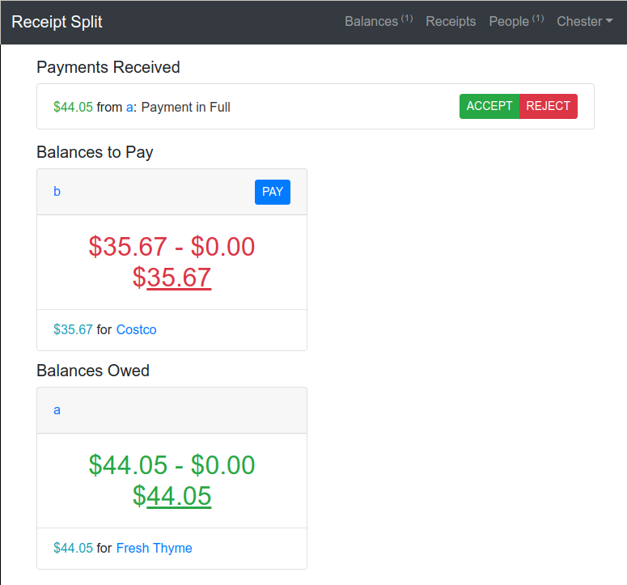
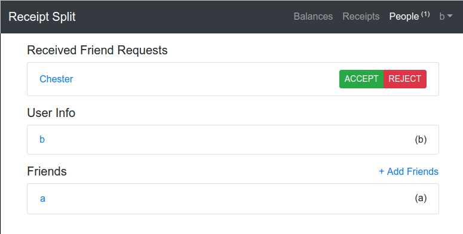

# Receipt-split 

## Screenshots






## Project description

1. Project Type: Plan A or B or C

    * I tried to go for Plan A

2. Group Members Name:

    * Isaac Lo

3. Link to live Application:

    * http://receipt-split.s3-website-us-east-1.amazonaws.com

4. Link to Github Code Repository: Make sure that you provide the link to project code and not the link to your homepage of GitHub repository.

    * https://github.com/isaaclo123/receipt-split

5. List of Technologies/API's Used

    * To develop this application, I used a React JS front-end with redux and typescript. I tried to
      use redux-saga, but that proved to be mostly uneccesary for the application. React-bootstrap
      was used to make the site nicely styled. A backend was developed in flask with marshmallow
      serialization and sqlalchemy. flask-jwt was used for JWT authentication.

6. Detailed Description of the project (No more than 500 words)

    * this project is an application that allows people to share the costs of receipts. When one
      enters the site for the first time, they are shown a balance page. If one goes to "receipts",
      they have the option to add new receipts and view created receipts. When one creates a
      receipt, they have to option to add other users to share the cost of the receipt, as well as
      change some other receipt information, such as the date in "YYYY-MM-DD" format, or the receipt
      name. They have the option to add receipt items. These receipt items can have users added to
      them, which will cause costs to be subtracted and added to what each individual user must pay.
      This would indicate that there is a specific receipt item only certain users used, and the
      amount each person would have to pay would change as a result. On saving the receipt, a list
      of balances each person must pay will appear on the bottom. This will be shown reflected on
      the balances page. To add more people to receipts, one should do so by friending more users.
      This is done by going to the people page, selecting "add friend", and adding users.

7. List of Controllers and their short description (No more than 50 words for each controller)

    * there is a controller for getting user information, such as friends, and balances "/user"
    * there is a controller for creating (GET), updating (PUT), and deleting (DELETE (unused))
      receipts with a certain id
    * there is a controller for getting default receipt information (GET) and creating (PUT)
      receipts, "/receipt/-1"
    * there is a controller for adding friends (POST empty) "/friends/:username"

8. List of Views and their short description (No more than 50 words for each view)

    * the balances page contains a list of overall balances, that have been calculated from the
      receipts. It contains balances you must pay other users and balances other users owe you. It
      also includes balances you pay yourself within it. "/app/balance"
    * the receipts page contains a list of receipts "app/receipt". You are able to edit receipts if
      you own them, by clicking on them "app/receipt/:id".
    * the people page contains a list of friends you have, with username on a list on the left and
    * fullname on the right. There is an "add friend" link that opens a modal to add a friend by
      username.

9. List of Tables, their Structure and short description

    * User: contains username, a password hash, fullname, and references to balances and receipt
      items, and friends (a list of other users)
    * Receipt: contains the name and date of a receipt, with the creating user (user). Has a decimal
      amount, indicating the amount the receipt cost, and a list of users, or the people who are
      included in the cost of the receipt. It contains a list of receipt_items, and a list of
      balances that are calculated.
    * Receipt item: an item whose cost is only shared by some of the people in the receipt. Contains
      an amount, a list of users sharing the item, and a name.
    * Balance: represents something a user must pay. contains a to_user and a from_user and an
      amount. the "to_user" must pay the "from_user" "amount"

10. References/Resources: List all the references, resources or the online templates that were used for the project.

    * https://flask-marshmallow.readthedocs.io/en/latest/
    * https://www.typescriptlang.org/
    * https://auth0.com/blog/beyond-create-react-app-react-router-redux-saga-and-more/
    * https://flask-sqlalchemy.palletsprojects.com/en/2.x/

## Database

```bash
flask db init
flask db migrate
flask db upgrade
```

## Command to upload to s3

```bash
npm run build
aws s3 cp build s3://receipt-split --recursive
```

## Docker commands

```bash
docker build -t receipt-split .
docker run -p 5000:5000 -e $NAME_OF_ENV_FILE receipt-split
```
